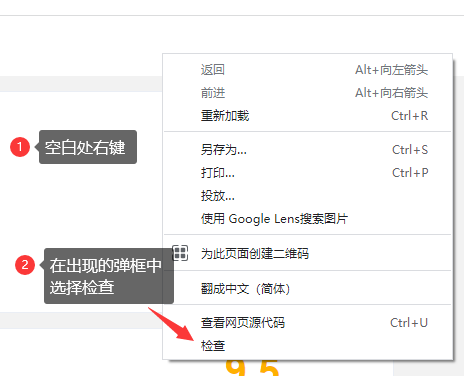
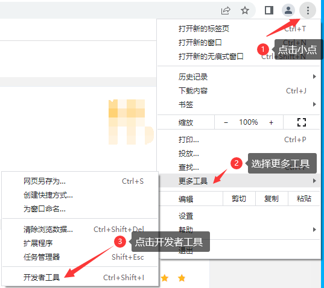
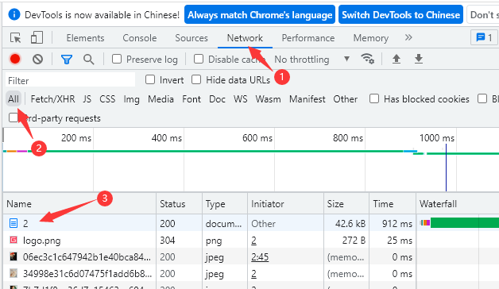
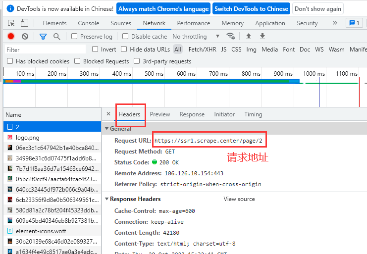
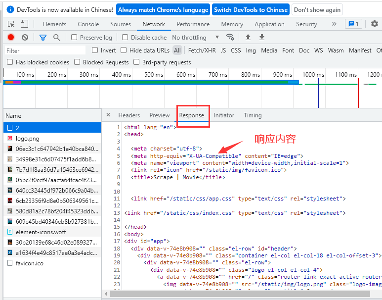

## 一.爬虫概念和作用

+ **概念**:		

  网络爬虫也叫网络蜘蛛，特指一类自动批量下载网络资源的程序，这是一个比较口语化的定义。
  更加专业和全面对的定义是：**网络爬虫是伪装成客户端与服务端进行数据交互的程序**.

+ **作用**

  1. 数据采集
         大数据时代来临，数据就是核心，数据就是生产力，越来越多的企业开始注重收集用户数据，而爬虫技术是收集数据的一种重要手段。
  2. 搜索引擎
         百度，谷歌等搜索引擎都是基于爬虫技术。
  3. 模拟操作
         爬虫也被广泛用于模拟用户操作，测试机器人，灌水机器人等。

## 二.爬虫原理

​					**伪装成客户端与服务端进行数据交互**

### 网络架构  （客户端和服务端）

1. c/s 即 client server 客户端 服务端

2. b/s 即 browser server 浏览器 服务端

3. m/s 即 mobile server 移动端 服务端

互联网的飞速发展是商业经济推动的。目前几乎所有的商业应用都是基于互联网的，它们一般采用c/s架构，b/s架构或者m/s架构。

### HTTP协议（数据交互）

#### 1.原因

计算机之间的交流与人之间的交流类似,人之间要说汉语,遵循一定的语法结构,普通话,声音洪亮等要求,这些要求,或约数,或规则,也可以叫做协议;这种协议保障了交流可能,能够互相理解对方传达的具体信息;计算机之间也是需要一种规则,保障之间信息的有效交流,这就是HTTP协议;

#### 2.概念和特点

* HTTP是Hyper Text Transfer Protocol（超文本传输协议）的缩写，是用于从万维网（WWW: World Wide Web ）服务器传输超文本到本地浏览器的传送协议。
* 目前互连网上90%的网络传输都是基于http协议。
* HTTP是一个基于TCP/IP通信协议来传递数据（HTML 文件, 图片文件, 查询结果等）;ps:使用TCP通信协议的重要的原因是基于其   面向连接的  特点;

#### 3.HTTP协议的使用

##### HTTP请求流程  

一次http请求的基本流程是，有客户端向服务端发起一次请求(request), 而服务器在接收到以后返回给客户端一个响应（response）。所以一次完整的http请求包含请求和响应两部分。

##### URL（网址）

* 发送http请求时，通过URL对网络资源进行定位。
  * URL（Uniform Resource Locator），中文叫统一资源定位符。是用来标识某一处资源的地址。也即是我们常说的网址。以下面这个URL为例，介绍下普通URL的各部分组成：

**示例网址：https://ssr1.scrape.center/**

- ##### 1.打开调试面板

  - 方式一

    - F12/ctrl+shift+I

  - 方式二

    ### 

  - 方式三

    ### 

- ##### 2.查看请求url和响应

  - 选择会话

    #### 

  - 查看会话

    

    

    ###  						

##### **HTTP请求格式 (请求行,请求头,空行,请求体)**

客户端发送一个HTTP请求到服务器的请求消息包括以下部分：请求行，请求头，空行和请求数据。

###### 请求行

根据http标准，http请求可以使用多种请求方法。

1.0定义了三种请求方法：GET，POST和HEAD方法

1.1新增了五种请求方法：OPTIONS，PUT，DELETE，TRACE和CONNECT方法。

| 序号   | 方法      | 描述                                       |
| ---- | ------- | ---------------------------------------- |
| 1    | HEAD    | 向服务器索与GET请求相一致的响应，只不过响应体将不会被返回,用于获取报头;   |
| 2    | GET     | 请求指定的页面信息,并返回实体的主体                       |
| 3    | POST    | 向指定资源提交数据进行处理请求（例如提交表单或者上传文件）。数据被包含在请求体中。POST请求可能会导致新的资源的建立和/或已有资源的修改。 |
| 4    | PUT     | 向指定资源位置上传其最新内容,一般用于更改内容;                 |
| 5    | DELETE  | 请求服务器删除Request-URL所指定的资源                 |
| 6    | OPTIONS | 允许客户端查看服务器性能                             |
| 7    | TRACE   | 回显服务器收到的请求，主要用于测试或诊断                     |
| 8    | CONNECT | HTTP/1.1协议中预留给能够将连接改为管道方式的代理服务器。         |

注意：

1）方法名称是区分大小写的，当某个请求所针对的资源不支持对应的请求方法的时候，服务器应当返回状态码405（Method Not Allowed）；当服务器不认识或者不支持对应的请求方法时，应返回状态码501（Not Implemented）。

2）HTTP服务器至少应该实现GET和HEAD/POST方法，其他方法都是可选的，此外除上述方法，特定的HTTP服务器支持扩展自定义的方法

常用方法

- GET
  1.主要是负责从服务器获取数据
  2.URL中添加请求参数,显示在地址栏
  3.请求字符串限制 1024个字节
  比`POST`更加高效和方便。
- POST
  1.主要负责向服务器提交数据
  2.没有大小限制
  比'GET'传递数据量大,安全性高。

###### 请求头

请求头部由关键字/值对组成，每行一对，关键字和值用英文冒号“:”分隔。请求头部通知服务器有关于客户端请求的信息，典型的请求头有：

* User-Agent：产生请求的[浏览器](http://www.chinabyte.com/keyword/浏览器/)类型;
* referer：页面跳转处，表明产生请求的网页来自于哪个URL，告诉服务器我是从哪个链接过来的，比如从我主页上链接到一个朋友那里，他的服务器就能够从HTTP Referer中统计出每天有多少用户点击我主页上的链接访问他的网站。
* Accept：客户端可识别的响应内容类型列表;星号 “ * ” 用于按范围将类型分组，用 “ */* ” 指示可接受全部类型，用“ type/* ”指示可接受 type 类型的所有子类型;
* Accept-Language：客户端可接受的自然语言;
* Accept-Encoding：客户端可接受的编码压缩格式;
* Accept-Charset：可接受的应答的字符集;
* Host：请求的主机名，允许多个[域名](http://www.chinabyte.com/keyword/域名/)同处一个IP 地址，即虚拟主机;
* connection：连接方式(close 或 keepalive);
* Cookie：[存储](http://storage.chinabyte.com/)于客户端扩展字段，向同一域名的服务端发送属于该域的cookie;
* Content-Length：发送给HTTP服务器数据的长度。
* Content-Type：具体请求的媒体的类型信息，力图  text/html  代表HTML格式，image/gif代表gif图片，application/json代表Json类型
* Content-Range：响应资源的范围。可以在每次请求中标记请求的资源范围，在连接断开重连时，客户端只请求该资源未下载的部分，而不是重新请求整个资源，实现断点续传。
* Cache-Control：指定请求和响应遵循的缓存机制。在请求消息或响应消息中设置Cache-Contro并不会修改另一个消息消息处理过程中的缓存处理过程。请求时的缓存指令包括no-cache、no-store、man-age、max-stake、min-fresh、only-if-cached；响应消息中的指令包括 public、privete、no-cache、no-store、no-transform、must-revalidate、proxy-revalidate、max-age

###### 空行

最后一个请求头之后是一个空行，发送回车符和换行符，通知服务器以下不再有请求头;

###### 请求体

请求体不在 GET 方法中使用，而是在POST 方法中使用。POST 方法适用于需要客户填写表单的场合。与请求体相关的最常使用的是包体类型 Content-Type 和包体长度 Content-Length;

##### **HTTP响应格式 (状态行,响应头,空行,响应正文)**

###### 状态行

状态行由 HTTP 协议版本、状态码和状态码的描述文本 3 个部分组成，他们之间使用空格隔开;

* 状态码   由三位数字组成，第一位数字表示响应的类型，常用的状态码有五大类如下所示：

  * 1xx：表示服务器已接收了客户端请求，客户端可继续发送请求;

  * 2xx：表示服务器已成功接收到请求并进行处理;

  * 3xx：表示服务器要求客户端重定向;

  * 4xx：表示客户端的请求有非法内容;

  * 5xx：表示服务器未能正常处理客户端的请求而出现意外错误;

* 状态码描述文本有如下取值：

  * 200 OK：表示客户端请求成功;

  * 400 Bad Request：表示客户端请求有语法错误，不能被服务器所理解;

  * 401 Unauthonzed：表示请求未经授权，该状态代码必须与 WWW-Authenticate 报头域一起使用;

  * 403 Forbidden：表示服务器收到请求，但是拒绝提供服务，通常会在响应正文中给出不提供服务的原因;

  * 404 Not Found：请求的资源不存在，例如，输入了错误的URL;

  * 500 Internal Server Error：表示服务器发生不可预期的错误，导致无法完成客户端的请求;

  * 503 Service Unavailable：表示服务器当前不能够处理客户端的请求，在一段时间之后，服务器可能会恢复正常;

###### 响应头

* Allow服务器支持哪些请求方法（如GET、POST等）。
* Date表示消息发送的时间，时间的描述格式由rfc822定义。例如，Date:Mon，31Dec200104：25：57GMT。Date描述的时间表示世界标准时，换算成本地时间，需要知道用户所在的时区。
* Set-Cookie非常重要的header，用于把cookie发送到客户端浏览器，每一个写入cookie都会需要一个Set-Cookie。
* Expires指定Response的过期时间，从而不再缓存它，重新从服务器获取，会更新缓存。过期之前使用本地缓存。降低服务器负载，缩短加载时间。
* Content-Type WEB服务器告诉客户端自己响应的对急的类型和字符集。
* Content-Encoding：内容编码格式

###### 空行

响应头和响应体由空行连接。 最后一个响应头之后是一个空行，发送回车符和换行符，通知客户端以下不再有请响应头;

###### 响应体

该响应消息的响应体是一个html文档。浏览器可以直接识别这个html文件。而我们访问的是一个jsp文件，响应回去的是一个html文件。说明服务器将该jsp翻译成了一个html，然后再响应给浏览器。

##### HTTP三点注意事项

- HTTP是无连接：无连接的含义是限制每次连接只处理一个请求。服务器处理完客户的请求，并收到客户的应答后，即断开连接。采用这种方式可以节省传输时间。
- HTTP是媒体独立的：这意味着，只要客户端和服务器知道如何处理的数据内容，任何类型的数据都可以通过HTTP发送。
- HTTP是无状态：HTTP协议是无状态协议。无状态是指协议对于事务处理没有记忆能力。缺少状态意味着如果后续处理需要前面的信息，则它必须重传，这样可能导致每次连接传送的数据量增大。另一方面，在服务器不需要先前信息时它的应答就较快。  ps：这种无状态的情况，并不适合我们进行业务需求，我们需要保持我们的登录状态，方便我们访问。

##### HTTP请求流程总结

### HTTPS

HTTPS（全称：Hyper Text Transfer Protocol over Secure Socket Layer 或 Hypertext Transfer Protocol Secure，超文本传输安全协议），是以安全为目标的HTTP通道，简单讲是HTTP的安全版
http协议是基于TCP/IP协议的，而https是在http协议的基础之上，再加了一层SSL/TLS协议，数据在传输过程中是加密的。
HTTPS协议的默认端口是443

## 三.会话技术

### 原因

http是无状态的，那服务端怎么区分同一个用户的连续请求呢，这就用到了会话技术：cookie和session。

### 概念

* **Cookie**有时也用其复数形式 Cookies。
  指某些网站为了辨别用户身份、进行 session 跟踪而储存在用户本地终端上的数据（通常经过加密）。最新的规范是 RFC6265  。

* Cookie   可以理解为一个凭证
  1.实际是由服务器发给客户端的特殊信息，
  2.这些信息以文本文件的方式存放在客户端，
  3.客户端每次向服务器发送请求的时候都会带上这些特殊的信息。 
  服务器在接收到Cookie以后，会验证Cookie的信息，以此来辨别用户的身份。

例如：小蓝去某个地方去游玩，这地方有好多小景点，每个小景点都可一单独的售票（这就相当于是http的无状态特点，每个请求需要重新验证身份（每个景点重新买票））；但是但是可以通过到售票处购买套票或者是办年卡的方式，然后带着这个凭证去与各个景点就可以了；（这就相当于我登录了一次，获取到了cookie，下次再去访问的时候，验证cookie就可以了，不用再重新的登录了，这就保持了登录状态）

*****

**Session**中文经常翻译为会话，其本来的含义是指有始有终的一系列动作/消息，比如打电话时从拿起电话拨号到挂断电话这中间的一系列过程可以称之为一个session。这个词在各个领域都有在使用，而我们web领域，一般使用的是其本义，一个浏览器窗口从打开到关闭这个期间。

Session的目的则是，在一个客户从打开浏览器到关闭浏览器这个期间内，发起的所有请求都可以被识别为同一个用户。

而实现的方式则是，在一个客户打开浏览器开始访问网站的时候，会生成一个cookie，SessionID，这个ID每次的访问都会带上，而服务器会识别这个SessionID并且将与这个SessionID有关的数据保存在服务器上。由此来实现客户端的状态识别。因此**session是基于cookie的**.

Session与Cookie相反，**Session是存储在服务器上的数据**，只由客户端传上来的SessionId来进行判定，所以相对于Cookie，Session的安全性更高。

一般SessionID会在浏览器被关闭时丢弃，或者服务器会验证Session的活跃程度，例如30分钟某一个SessionID都没有活跃，那么也会被识别为失效。

例如：在进行登录的时候，登录的是QQ空间；用户输入用户名和密码登录，服务器验证玩用户名和密码会，当正确之后，会在session表中存储一个键 hash值，并对应一个value值--登录成功；同时服务器会将hash值返回到客户端(网页就是浏览器),设置cookie的一个值为sessionid=hash值;再次进行访问的时候(例如去访问QQ邮箱),会带携带sessionid,服务器会验证这个sessionid (hash值),得到value值,确定登录状态.如果确定是登录成功,则返回给客户端需要的网页(QQ邮箱).

